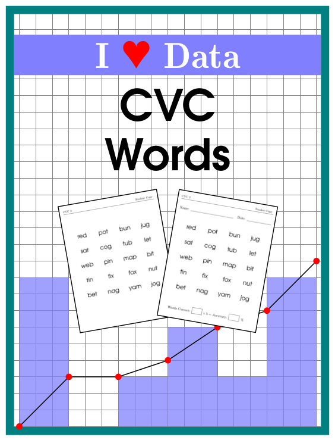
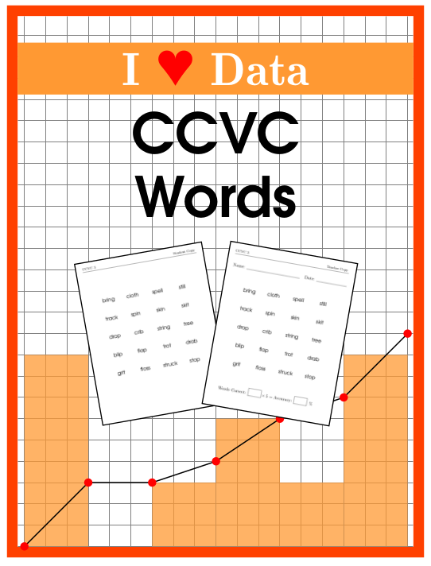

# I Heart Data

## About this Repository

Data collection allows teachers to monitor student progress and adjust the
curriculum accordingly. K-12 teachers often do not have the time to create the
tools necessary for proper data collection. This repository is the codebase for
a series of programatically generated assessments designed with long-term data
collection in mind. The goal is to make the process of data collection as easy
as possible, increasing the probability that teachers will be able to implement
these strategies. 

# Single Word Reading Accuracy Assessments

For assessments in this collection we generate 20 random samples of 20 words
each from a large list of common words requiring a specific skill (see below).
The sample size of 20 allows for quick mental calculation of the accuracy as a
percentage, and a data table and blank graph are provided for tracking accuracy
over time. For each sample, a student copy and a teacher copy of the assessment
are generated. The student copy could be reused for each student, or given to
the student to keep, while the teacher copy retains the date and accuracy
information.

## CVC Words

The ability to read consonant-vowel-consonant (CVC) words is an early reading
skill. Each sample of 20 words contains 4 words involving each short vowel
sound.

**Included:**
* Accuracy tracking table
* Accuracy plotting
* 20 random samples of CVC words (student copies)
* 20 random samples of CVC words (teacher copies)

## CCVC Words

These single syllable words begin with a consonant blend. Each sample of 20
contains 8 blends involving R, 6 involving S, 4 involving L, and 2 involving a
blend of three consonants.

**Included:**
* Accuracy tracking table
* Accuracy plotting
* 20 random samples of CCVC words (student copies)
* 20 random samples of CCVC words (teacher copies)
